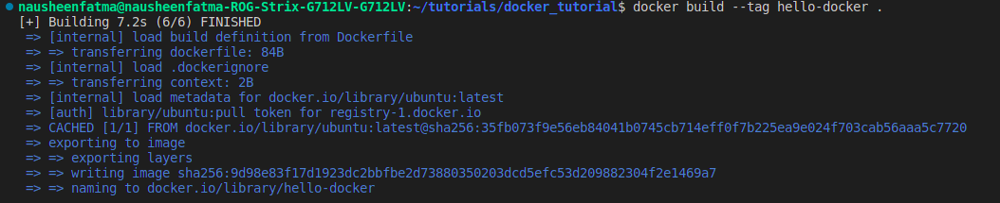
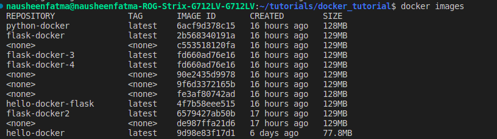
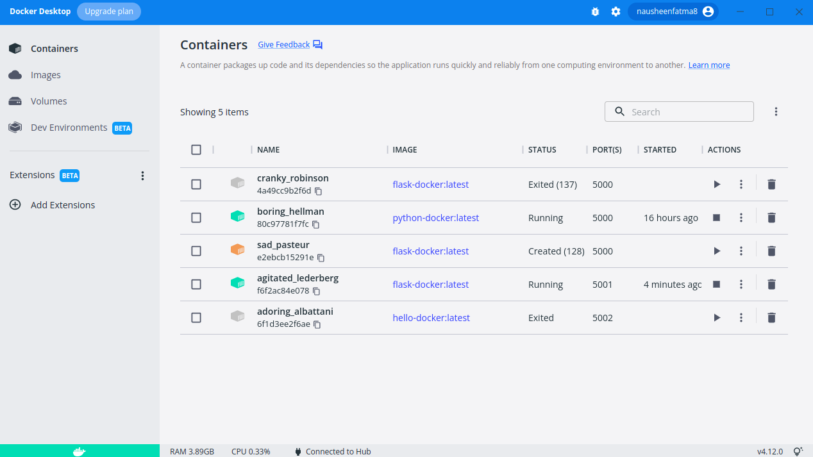
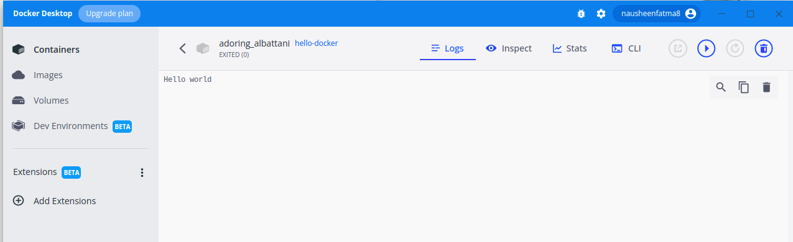

# basic_docker_tutorial

This repository is a super quick docker recipe- set ups, installation and running a super basic hello-world container, 
for people in a hurry :)
You can watch this amazing helpful tutorial video when you have 3+ hours at length: https://docs.docker.com/get-started/

## 1. Install docker
Follow steps from official website
https://docs.docker.com/desktop/install/linux-install/


## 2. Create a dockerhub account at
https://hub.docker.com/

## 3. Follow the steps docker_passphrase_steps.txt to generate docker_passphrase.

## 4. Write a dockerfile
The docker file takes a base ubuntu image (from dockerhub)
We add our own layers on top of this base images. We add our source codes, install dependencies, enviroment variables, commands. etc.

For now we just want to exceute a command using CMD to echo Hello World and test if this runs.

Thats all!

## 5. Build the image from dockerfile

```
 docker build --tag hello-docker .
```



## 6. List all docker images in your system

```
docker images
```



### 3. Run the image as container

```
docker run -d -p 5002:5002 hello-docker
```

### 4. Check on Docker Desktop

Checkt the last container. It ran and exited.



On click opening the container link you can see that it echoed 'Hello World' inside the container




Congrats. You are now all set to create some meaningful container images adding dependencies and code in it.
